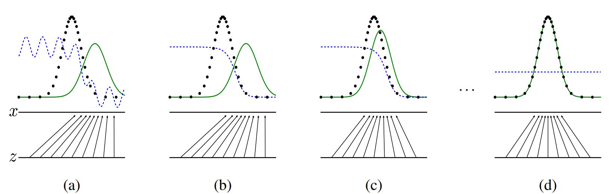

Generative Adversarial Networks

# Redes Generativas Adversariales

## Resumen

Proponemos un nuevo marco para la estimación de modelos generativos mediante un proceso adversarial, en el que simultáneamente entrenamos dos modelos: uno generativo y uno discriminativo. El modelo generativo captura la distribución de los datos, mientras que el modelo discriminativo estima la probabilidad de que una muestra provenga de los datos de entrenamiento en lugar del modelo generativo. El proceso de entrenamiento de este marco corresponde a un juego minimax de dos jugadores. Los experimentos demuestran que este procedimiento es capaz de generar imágenes de manera plausible y que puede aprender características generativas profundas en diversas aplicaciones.

---

Este abstract describe la propuesta y el objetivo principal del paper, proporcionando una visión general del enfoque novedoso de las Redes Generativas Adversariales y sus resultados experimentales.

## 1 Introducción

La promesa del aprendizaje profundo es descubrir modelos ricos y jerárquicos [2] que representen distribuciones de probabilidad sobre los tipos de datos encontrados en aplicaciones de inteligencia artificial, tales como imágenes naturales, formas de onda de audio que contienen habla y símbolos en corpus de lenguaje natural. Hasta ahora, los éxitos más notables en el aprendizaje profundo han involucrado modelos discriminativos, generalmente aquellos que mapean una entrada sensorial rica y de alta dimensión a una etiqueta de clase [14, 22]. Estos éxitos notables se han basado principalmente en los algoritmos de retropropagación y dropout, utilizando unidades lineales por partes [19, 9, 10] que tienen un gradiente particularmente bien comportado. Los modelos generativos profundos han tenido menos impacto debido a la dificultad de aproximar muchos cálculos probabilísticos intratables que surgen en la estimación de máxima verosimilitud y estrategias relacionadas, y debido a la dificultad de aprovechar los beneficios de las unidades lineales por partes en el contexto generativo. Proponemos un nuevo procedimiento de estimación de modelos generativos que evita estas dificultades.

En el marco de redes adversariales propuesto, el modelo generativo se enfrenta a un adversario: un modelo discriminativo que aprende a determinar si una muestra proviene de la distribución del modelo o de la distribución de los datos. El modelo generativo puede considerarse análogo a un equipo de falsificadores, tratando de producir moneda falsa y usarla sin ser detectados, mientras que el modelo discriminativo es análogo a la policía, tratando de detectar la moneda falsa. La competencia en este juego impulsa a ambos equipos a mejorar sus métodos hasta que los falsificaciones sean indistinguibles de los artículos genuinos.

Este marco puede generar algoritmos de entrenamiento específicos para muchos tipos de modelos y algoritmos de optimización. En este artículo, exploramos el caso especial cuando el modelo generativo genera muestras pasando ruido aleatorio a través de un perceptrón multicapa, y el modelo discriminativo también es un perceptrón multicapa. Nos referimos a este caso especial como redes adversariales. En este caso, podemos entrenar ambos modelos utilizando solo los algoritmos de retropropagación y dropout [17] y muestrear del modelo generativo utilizando solo la propagación hacia adelante. No es necesaria la inferencia aproximada ni las cadenas de Markov.

## 2 Trabajo Relacionado

Una alternativa a los modelos gráficos dirigidos con variables latentes son los modelos gráficos no dirigidos con variables latentes, como las máquinas de Boltzmann restringidas (RBMs) [27, 16], las máquinas de Boltzmann profundas (DBMs) [26] y sus numerosas variantes. Las interacciones dentro de estos modelos se representan como el producto de funciones potenciales no normalizadas, normalizadas mediante una suma/integración global sobre todos los estados de las variables aleatorias. Esta cantidad (la función de partición) y su gradiente son intratables para todos los casos salvo los más triviales, aunque pueden estimarse mediante métodos de Monte Carlo de cadena de Markov (MCMC). La mezcla plantea un problema significativo para los algoritmos de aprendizaje que dependen de MCMC [3, 5].

Las redes de creencias profundas (DBNs) [16] son modelos híbridos que contienen una capa no dirigida y varias capas dirigidas. Aunque existe un criterio de entrenamiento rápido y aproximado por capas, las DBNs incurren en las dificultades computacionales asociadas con los modelos tanto dirigidos como no dirigidos.

También se han propuesto criterios alternativos que no aproximan ni limitan la verosimilitud logarítmica, como el emparejamiento de puntuaciones (score matching) [18] y la estimación de contraste de ruido (NCE) [13]. Ambos requieren que la densidad de probabilidad aprendida se especifique analíticamente hasta una constante de normalización. Cabe señalar que en muchos modelos generativos interesantes con varias capas de variables latentes (como las DBNs y las DBMs), ni siquiera es posible derivar una densidad de probabilidad no normalizada tratable. Algunos modelos, como los autoencoders de denoising [30] y los autoencoders contractivos, tienen reglas de aprendizaje muy similares al emparejamiento de puntuaciones aplicadas a las RBMs. En NCE, como en este trabajo, se emplea un criterio de entrenamiento discriminativo para ajustar un modelo generativo. Sin embargo, en lugar de ajustar un modelo discriminativo separado, el propio modelo generativo se utiliza para discriminar los datos generados de las muestras de una distribución de ruido fija. Debido a que NCE usa una distribución de ruido fija, el aprendizaje se ralentiza drásticamente después de que el modelo ha aprendido incluso una distribución aproximadamente correcta sobre un pequeño subconjunto de las variables observadas.

Finalmente, algunas técnicas no implican definir explícitamente una distribución de probabilidad, sino que entrenan una máquina generativa para extraer muestras de la distribución deseada. Este enfoque tiene la ventaja de que tales máquinas pueden diseñarse para ser entrenadas mediante retropropagación. El trabajo reciente más destacado en esta área incluye el marco de redes estocásticas generativas (GSN) [5], que extiende los autoencoders de denoising generalizados [4]: ambos pueden verse como definiciones de una cadena de Markov parametrizada, es decir, uno aprende los parámetros de una máquina que realiza un paso de una cadena de Markov generativa. En comparación con las GSNs, el marco de redes adversariales no requiere una cadena de Markov para el muestreo. Debido a que las redes adversariales no requieren bucles de retroalimentación durante la generación, son mejor capaces de aprovechar las unidades lineales por partes [19, 9, 10], que mejoran el rendimiento de la retropropagación pero tienen problemas con la activación ilimitada cuando se usan en un bucle de retroalimentación. Ejemplos más recientes de entrenamiento de una máquina generativa mediante retropropagación incluyen el trabajo reciente sobre la variación autoencodificadora Bayesiana [20] y la retropropagación estocástica [24].

## 3 Redes Adversariales

El marco de modelado adversarial es más sencillo de aplicar cuando ambos modelos son perceptrones multicapa. Para aprender la distribución \( p_g \) del generador sobre los datos \( x \), definimos una distribución previa en las variables de ruido de entrada \( p_z(z) \), luego representamos un mapeo al espacio de datos como \( G(z; \theta_g) \), donde \( G \) es una función diferenciable representada por un perceptrón multicapa con parámetros \( \theta_g \). También definimos un segundo perceptrón multicapa \( D(x; \theta_d) \) que produce un único escalar. \( D(x) \) representa la probabilidad de que \( x \) provenga de los datos en lugar de \( p_g \). Entrenamos \( D \) para maximizar la probabilidad de asignar la etiqueta correcta tanto a los ejemplos de entrenamiento como a las muestras de \( G \). Simultáneamente, entrenamos \( G \) para minimizar \( \log(1 - D(G(z))) \):

En otras palabras, \( D \) y \( G \) juegan el siguiente juego minimax de dos jugadores con la función de valor \( V(G, D) \):

\[ 
\min_G \max_D V(D, G) = \mathbb{E}_{x \sim p_{data}(x)} \left[ \log D(x) \right] + \mathbb{E}_{z \sim p_z(z)} \left[ \log(1 - D(G(z))) \right]. \quad (1)
\]

En la siguiente sección, presentamos un análisis teórico de las redes adversarias, mostrando esencialmente que el criterio de entrenamiento permite recuperar la distribución generadora de datos cuando G (generador) y D (discriminador) tienen suficiente capacidad, es decir, en el límite no paramétrico. Consulta la Figura 1 para una explicación menos formal y más pedagógica del enfoque.

En la práctica, debemos implementar el juego utilizando un enfoque numérico iterativo. Optimizar D completamente en cada iteración de entrenamiento es computacionalmente prohibitivo y, en conjuntos de datos finitos, podría resultar en sobreajuste. En su lugar, alternamos entre k pasos de optimización de D y un paso de optimización de G. Esto mantiene a D cerca de su solución óptima, siempre y cuando G cambie lo suficientemente lentamente.

Esta estrategia es análoga a la forma en que el entrenamiento SML/PCD [31, 29] mantiene muestras de una cadena de Markov de un paso de aprendizaje al siguiente para evitar que la cadena de Markov se queme como parte del bucle interno de aprendizaje. El procedimiento se presenta formalmente en el Algoritmo 1.

En la práctica, la ecuación 1 puede no proporcionar suficiente gradiente para que G aprenda bien. Al principio del aprendizaje, cuando G es deficiente, D puede rechazar muestras con alta confianza porque claramente difieren de los datos de entrenamiento. En este caso, `log(1 − D(G(z)))` se satura. En lugar de entrenar a G para minimizar `log(1 − D(G(z)))`, podemos entrenar a G para maximizar `log D(G(z))`. Esta función objetivo produce el mismo punto fijo en la dinámica de G y D, pero proporciona gradientes mucho más fuertes al principio del aprendizaje.



**Figura 1:** Las redes generativas adversariales se entrenan actualizando simultáneamente la distribución discriminativa (D, línea azul punteada) para que discrimine entre muestras de la distribución generadora de datos (línea negra punteada) \( p_{\text{data}} \) y las de la distribución generativa \( p_g(G) \) (línea verde sólida). La línea horizontal inferior es el dominio desde el cual se muestrea z, en este caso de manera uniforme. La línea horizontal superior es parte del dominio de x. Las flechas hacia arriba muestran cómo el mapeo x = G(z) impone la distribución no uniforme \( p_g \) en las muestras transformadas. G contrae en regiones de alta densidad y se expande en regiones de baja densidad de \( p_g \).

(a) Considera un par adversarial cerca de la convergencia: \( p_g \) es similar a \( p_{\text{data}} \) y D es un clasificador parcialmente preciso.

(b) En el bucle interno del algoritmo, D se entrena para discriminar muestras de datos, convergiendo a \( D^*(x) = \frac{p_{\text{data}}(x)}{p_{\text{data}}(x) + p_g(x)} \).

(c) Después de una actualización de G, el gradiente de D ha guiado a G(z) hacia regiones que son más propensas a ser clasificadas como datos.

(d) Después de varias etapas de entrenamiento, si G y D tienen suficiente capacidad, alcanzarán un punto en el cual ambos no puedan mejorar más porque \( p_g = p_{\text{data}} \). El discriminador no puede diferenciar entre las dos distribuciones, es decir, \( D(x) = \frac{1}{2} \).

### 4 Resultados Teóricos

El generador G define implícitamente una distribución de probabilidad \( p_g \) como la distribución de las muestras G(z) obtenidas cuando \( z \sim p_z \). Por lo tanto, nos gustaría que el Algoritmo 1 converja a un buen estimador de \( p_{\text{data}} \), si se le proporciona suficiente capacidad y tiempo de entrenamiento. Los resultados de esta sección se realizan en un entorno no paramétrico, por ejemplo, representamos un modelo con capacidad infinita estudiando la convergencia en el espacio de funciones de densidad de probabilidad.

Mostraremos en la sección 4.1 que este juego minimax tiene un óptimo global para \( p_g = p_{\text{data}} \). Luego demostraremos en la sección 4.2 que el Algoritmo 1 optimiza la siguiente función objetivo:

\[ \min_G \max_D V(D, G) = \mathbb{E}_{x \sim p_{\text{data}}(x)} [\log D(x)] + \mathbb{E}_{z \sim p_z(z)} [\log(1 - D(G(z)))] \quad (1) \]

Obteniendo así el resultado deseado.


### Algoritmo 1: Entrenamiento de redes generativas adversariales mediante descenso de gradiente estocástico por minibatches

El número de pasos a aplicar al discriminador, k, es un hiperparámetro. En nuestros experimentos utilizamos k = 1, la opción menos costosa.

```plaintext
Para cada iteración de entrenamiento hacer
  Para k pasos hacer
    • Muestrear minibatch de m muestras de ruido {z^(1), ..., z^(m)} de la distribución de ruido pg(z).
    • Muestrear minibatch de m ejemplos {x^(1), ..., x^(m)} de la distribución generadora de datos pdata(x).
    • Actualizar el discriminador ascendiendo su gradiente estocástico:
      ∇θ_d 1/m ∑ᵢ [log D(x^(i))] + log [1 - D(G(z^(i)))]

  • Muestrear minibatch de m muestras de ruido {z^(1), ..., z^(m)} de la distribución de ruido pg(z).
  • Actualizar el generador descendiendo su gradiente estocástico:
    ∇θ_g 1/m ∑ᵢ log [1 - D(G(z^(i)))]
```
Los ajustes basados en gradientes pueden utilizar cualquier regla de aprendizaje basada en gradientes estándar. Utilizamos momentum en nuestros experimentos.

### 4.1 Optimalidad Global de \( p_g = p_{\text{data}} \)

Primero consideramos el discriminador óptimo D para cualquier generador G.

**Proposición 1.** Para G fijo, el discriminador óptimo D es:

\[ D^*_G(x) = \frac{p_{\text{data}}(x)}{p_{\text{data}}(x) + p_g(x)} \quad (2) \]

**Demostración.** El criterio de entrenamiento para el discriminador D, dado cualquier generador G, es maximizar la cantidad \( V(G, D) \):

\[ V(G, D) = \int_x p_{\text{data}}(x) \log(D(x)) \, dx + \int_z p_z(z) \log(1 - D(G(z))) \, dz \]

\[ = \int_x p_{\text{data}}(x) \log(D(x)) + p_g(x) \log(1 - D(x)) \, dx \]

Para cualquier \( (a, b) \in \mathbb{R}^2 \setminus \{0, 0\} \), la función \( y \to a \log(y) + b \log(1 - y) \) alcanza su máximo en [0, 1] en \( \frac{a}{a + b} \). El discriminador no necesita estar definido fuera de Supp(p_{\text{data}}) ∪ Supp(p_g), concluyendo la demostración.

Nota que el objetivo de entrenamiento para D puede interpretarse como la maximización del log-likelihood para estimar la probabilidad condicional \( P(Y = y | x) \), donde Y indica si x proviene de \( p_{\text{data}} \) (con y = 1) o de \( p_g \) (con y = 0). El juego minimax en la Ec. 1 ahora puede reformularse como:

\[ C(G) = \max_D V(G, D) \]

\[ = \mathbb{E}_{x \sim p_{\text{data}}} [\log D^*_G(x)] + \mathbb{E}_{z \sim p_z} [\log(1 - D^*_G(G(z)))] \]

\[ = \mathbb{E}_{x \sim p_{\text{data}}} \left[ \log \left( \frac{p_{\text{data}}(x)}{p_{\text{data}}(x) + p_g(x)} \right) \right] + \mathbb{E}_{x \sim p_g} \left[ \log \left( \frac{p_g(x)}{p_{\text{data}}(x) + p_g(x)} \right) \right] \]

### Teorema 1. El mínimo global del criterio de entrenamiento virtual C(G) se alcanza si y solo si pg = pdata. En ese punto, C(G) alcanza el valor - log 4.

**Demostración.** Para pg = pdata, \( D^*_G(x) = \frac{1}{2} \) (ver Eq. 2). Por lo tanto, inspeccionando la Eq. 4 con \( D^*_G(x) = \frac{1}{2} \), encontramos que \( C(G) = \log \frac{1}{2} + \log \frac{1}{2} = - \log 4 \). Para ver que este es el mejor valor posible de C(G), alcanzado solo para pg = pdata, observamos que

\[ \mathbb{E}_{x \sim pdata} [- \log 2] + \mathbb{E}_{x \sim pg} [- \log 2] = - \log 4 \]

y que al restar esta expresión de \( C(G) = V(D^*_G, G) \), obtenemos:

\[ C(G) = - \log(4) + \text{KL} \left( pdata \parallel \frac{pdata + pg}{2} \right) + \text{KL} \left( pg \parallel \frac{pdata + pg}{2} \right) \quad (5) \]

donde KL es la divergencia de Kullback-Leibler. Reconocemos en la expresión anterior la divergencia Jensen-Shannon entre la distribución del modelo y el proceso generador de datos:

\[ C(G) = - \log(4) + 2 \cdot \text{JSD} (pdata \| pg) \quad (6) \]

Dado que la divergencia Jensen-Shannon entre dos distribuciones siempre es no negativa y cero solo cuando son iguales, hemos demostrado que \( C^* = - \log(4) \) es el mínimo global de C(G) y que la única solución es pg = pdata, es decir, el modelo generativo replica perfectamente el proceso generador de datos.

### 4.2 Convergencia del Algoritmo 1

**Proposición 2.** Si G y D tienen suficiente capacidad, y en cada paso del Algoritmo 1, el discriminador se permite alcanzar su óptimo dado G, y pg se actualiza para mejorar el criterio

\[ \mathbb{E}_{x \sim pdata} [\log D^*_G(x)] + \mathbb{E}_{x \sim pg} [\log(1 - D^*_G(x))] \]

entonces pg converge a pdata.

**Demostración.** Consideramos \( V(G, D) = U(pg, D) \) como una función de pg, como se hizo en el criterio anterior. Notamos que U(pg, D) es convexo en pg. Los subderivados de un supremo de funciones convexas incluyen la derivada de la función en el punto donde se alcanza el máximo. En otras palabras, si \( f(x) = \sup_{\alpha \in A} f_\alpha(x) \) y \( f_\alpha(x) \) es convexa en x para cada \( \alpha \), entonces \( \partial f_\beta(x) \in \partial f \) si \( \beta = \arg \sup_{\alpha \in A} f_\alpha(x) \). Esto es equivalente a calcular una actualización de descenso de gradiente para pg en el D óptimo dado el G correspondiente. \( \sup_D U(pg, D) \) es convexo en pg con un único óptimo global como se demostró en el Teorema 1, por lo tanto, con actualizaciones suficientemente pequeñas de pg, pg converge a px, concluyendo la demostración.

En la práctica, las redes adversarias representan una familia limitada de distribuciones pg a través de la función G(z; θ_g), y optimizamos θ_g en lugar de pg en sí mismo. El uso de un perceptrón multicapa para definir G introduce múltiples puntos críticos en el espacio de parámetros. Sin embargo, el excelente rendimiento de los perceptrones multicapa en la práctica sugiere que son un modelo razonable para usar a pesar de la falta de garantías teóricas.

### 5 Experimentos

Entrenamos redes adversarias en una variedad de conjuntos de datos incluyendo MNIST [23], la Base de Datos de Caras de Toronto (TFD) [28], y CIFAR-10 [21]. Las redes generadoras utilizaron una mezcla de activaciones rectificadoras lineales [19, 9] y activaciones sigmoideas, mientras que la red discriminadora utilizó activaciones maxout [10]. Se aplicó dropout [17] en el entrenamiento de la red discriminadora. Aunque nuestro marco teórico permite el uso de dropout y otros ruidos en capas intermedias del generador, solo utilizamos ruido como entrada en la capa más baja de la red generadora.

Estimamos la probabilidad del conjunto de datos de prueba bajo pg ajustando una ventana Gaussiana de Parzen a las muestras generadas con G y reportando el log-likelihood bajo esta distribución. El parámetro σ de las Gaussianas se obtuvo mediante validación cruzada en el conjunto de validación. Este procedimiento fue introducido en Breuleux et al. [8] y se utilizó para varios modelos generativos para los cuales la verosimilitud exacta no es tratable [25, 3, 5]. Los resultados se informan en la Tabla 1. Este método de estimación de la verosimilitud tiene una varianza bastante alta y no funciona bien en espacios de alta dimensión, pero es el mejor método disponible según nuestro conocimiento. Los avances en modelos generativos que pueden muestrear pero no estimar directamente la verosimilitud motivan futuras investigaciones sobre cómo evaluar tales modelos.

En las Figuras 2 y 3 mostramos muestras dibujadas de la red generadora después del entrenamiento. Aunque no afirmamos que estas muestras sean mejores que las muestras generadas por métodos existentes, creemos que al menos son competitivas con los mejores modelos generativos en la literatura y destacan el potencial del marco adversarial.

### Teorema 1. El mínimo global del criterio de entrenamiento virtual C(G) se alcanza si y solo si pg = pdata. En ese punto, C(G) alcanza el valor - log 4.

**Demostración.** Para pg = pdata, \( D^*_G(x) = \frac{1}{2} \) (ver Eq. 2). Por lo tanto, inspeccionando la Eq. 4 con \( D^*_G(x) = \frac{1}{2} \), encontramos que \( C(G) = \log \frac{1}{2} + \log \frac{1}{2} = - \log 4 \). Para ver que este es el mejor valor posible de C(G), alcanzado solo para pg = pdata, observamos que

\[ \mathbb{E}_{x \sim pdata} [- \log 2] + \mathbb{E}_{x \sim pg} [- \log 2] = - \log 4 \]

y que al restar esta expresión de \( C(G) = V(D^*_G, G) \), obtenemos:

\[ C(G) = - \log(4) + \text{KL} \left( pdata \parallel \frac{pdata + pg}{2} \right) + \text{KL} \left( pg \parallel \frac{pdata + pg}{2} \right) \quad (5) \]

donde KL es la divergencia de Kullback-Leibler. Reconocemos en la expresión anterior la divergencia Jensen-Shannon entre la distribución del modelo y el proceso generador de datos:

\[ C(G) = - \log(4) + 2 \cdot \text{JSD} (pdata \| pg) \quad (6) \]

Dado que la divergencia Jensen-Shannon entre dos distribuciones siempre es no negativa y cero solo cuando son iguales, hemos demostrado que \( C^* = - \log(4) \) es el mínimo global de C(G) y que la única solución es pg = pdata, es decir, el modelo generativo replica perfectamente el proceso generador de datos.

### 4.2 Convergencia del Algoritmo 1

**Proposición 2.** Si G y D tienen suficiente capacidad, y en cada paso del Algoritmo 1, el discriminador se permite alcanzar su óptimo dado G, y pg se actualiza para mejorar el criterio

\[ \mathbb{E}_{x \sim pdata} [\log D^*_G(x)] + \mathbb{E}_{x \sim pg} [\log(1 - D^*_G(x))] \]

entonces pg converge a pdata.

**Demostración.** Consideramos \( V(G, D) = U(pg, D) \) como una función de pg, como se hizo en el criterio anterior. Notamos que U(pg, D) es convexo en pg. Los subderivados de un supremo de funciones convexas incluyen la derivada de la función en el punto donde se alcanza el máximo. En otras palabras, si \( f(x) = \sup_{\alpha \in A} f_\alpha(x) \) y \( f_\alpha(x) \) es convexa en x para cada \( \alpha \), entonces \( \partial f_\beta(x) \in \partial f \) si \( \beta = \arg \sup_{\alpha \in A} f_\alpha(x) \). Esto es equivalente a calcular una actualización de descenso de gradiente para pg en el D óptimo dado el G correspondiente. \( \sup_D U(pg, D) \) es convexo en pg con un único óptimo global como se demostró en el Teorema 1, por lo tanto, con actualizaciones suficientemente pequeñas de pg, pg converge a px, concluyendo la demostración.

En la práctica, las redes adversarias representan una familia limitada de distribuciones pg a través de la función G(z; θ_g), y optimizamos θ_g en lugar de pg en sí mismo. El uso de un perceptrón multicapa para definir G introduce múltiples puntos críticos en el espacio de parámetros. Sin embargo, el excelente rendimiento de los perceptrones multicapa en la práctica sugiere que son un modelo razonable para usar a pesar de la falta de garantías teóricas.

### 5 Experimentos

Entrenamos redes adversarias en una variedad de conjuntos de datos incluyendo MNIST [23], la Base de Datos de Caras de Toronto (TFD) [28], y CIFAR-10 [21]. Las redes generadoras utilizaron una mezcla de activaciones rectificadoras lineales [19, 9] y activaciones sigmoideas, mientras que la red discriminadora utilizó activaciones maxout [10]. Se aplicó dropout [17] en el entrenamiento de la red discriminadora. Aunque nuestro marco teórico permite el uso de dropout y otros ruidos en capas intermedias del generador, solo utilizamos ruido como entrada en la capa más baja de la red generadora.

Estimamos la probabilidad del conjunto de datos de prueba bajo pg ajustando una ventana Gaussiana de Parzen a las muestras generadas con G y reportando el log-likelihood bajo esta distribución. El parámetro σ de las Gaussianas se obtuvo mediante validación cruzada en el conjunto de validación. Este procedimiento fue introducido en Breuleux et al. [8] y se utilizó para varios modelos generativos para los cuales la verosimilitud exacta no es tratable [25, 3, 5]. Los resultados se informan en la Tabla 1. Este método de estimación de la verosimilitud tiene una varianza bastante alta y no funciona bien en espacios de alta dimensión, pero es el mejor método disponible según nuestro conocimiento. Los avances en modelos generativos que pueden muestrear pero no estimar directamente la verosimilitud motivan futuras investigaciones sobre cómo evaluar tales modelos.

En las Figuras 2 y 3 mostramos muestras dibujadas de la red generadora después del entrenamiento. Aunque no afirmamos que estas muestras sean mejores que las muestras generadas por métodos existentes, creemos que al menos son competitivas con los mejores modelos generativos en la literatura y destacan el potencial del marco adversarial.

**Figura 2:** Visualización de muestras del modelo. La columna más a la derecha muestra el ejemplo de entrenamiento más cercano de la muestra vecina, con el fin de demostrar que el modelo no ha memorizado el conjunto de entrenamiento. Las muestras son selecciones aleatorias justas, no seleccionadas a dedo. A diferencia de la mayoría de las visualizaciones de modelos generativos profundos, estas imágenes muestran muestras reales de las distribuciones del modelo, no medias condicionales dadas muestras de unidades ocultas. Además, estas muestras son no correlacionadas porque el proceso de muestreo no depende de la mezcla de la cadena de Markov. a) MNIST b) TFD c) CIFAR-10 (modelo totalmente conectado) d) CIFAR-10 (discriminador convolucional y generador "deconvolucional")

**Figura 3:** Dígitos obtenidos mediante interpolación lineal entre coordenadas en el espacio \( z \) del modelo completo.

**Modelos gráficos dirigidos profundos**
**Modelos gráficos no dirigidos profundos**
**Autoencoders generativos**
**Modelos adversariales**
Necesidad de entrenamiento Inferencia
Necesidad de entrenamiento Inferencia
Se necesita MCMC para
aproximar la función de
gradiente de la función de
partición.
Compromiso forzoso
entre la mezcla y el
poder de la generación de
reconstrucción
Sincronización del
discriminador con el
generador.
Helvetica.
Inferencia
Inferencia aproximada
aprendida
Inferencia variacional
Inferencia basada en
MCMC
Inferencia aproximada
aprendida
Muestreo Sin dificultades Requiere cadena de Markov
Requiere cadena de Markov Sin dificultades
Evaluar p(x)
Intractable, puede
aproximarse con AIS
Intractable, puede
aproximarse con AIS
No está representado
explícitamente, puede
aproximarse con
estimación de densidad
Parzen
No está representado
explícitamente, puede
aproximarse con
estimación de densidad
Parzen
Diseño del modelo
Casi todos los modelos
incurren en una
dificultad extrema
Se necesita un diseño
cuidadoso para
asegurar múltiples
propiedades
Cualquier función
diferenciable es
teóricamente
permitida
Cualquier función
diferenciable es
teóricamente
permitida
Tabla 2: Desafíos en el modelado generativo: un resumen de las dificultades encontradas por diferentes enfoques de modelado generativo profundo para cada una de las operaciones principales que involucran a un modelo.

**Ventajas y desventajas**
Este nuevo marco viene con ventajas y desventajas en relación con los marcos de modelado anteriores. Las desventajas son principalmente que no hay una representación explícita de \( p_g(x) \) y que \( D \) debe estar bien sincronizado con \( G \) durante el entrenamiento (en particular, \( G \) no debe entrenarse demasiado sin actualizar \( D \), para evitar "el escenario Helvetica" en el que \( G \) colapsa demasiados valores de \( z \) al mismo valor de \( x \) para tener suficiente diversidad para modelar \( p_{\text{data}} \)), de la misma manera en que las cadenas negativas de una máquina de Boltzmann deben mantenerse actualizadas entre pasos de aprendizaje. Las ventajas son que nunca se necesitan cadenas de Markov, solo se utiliza retropropagación para obtener gradientes, no se necesita inferencia durante el aprendizaje y se puede incorporar una amplia variedad de funciones en el modelo. La Tabla 2 resume la comparación de las redes adversariales generativas con otros enfoques de modelado generativo.

Las ventajas mencionadas anteriormente son principalmente computacionales. Los modelos adversariales también pueden obtener alguna ventaja estadística del hecho de que la red generadora no se actualiza directamente con ejemplos de datos, sino solo con gradientes que fluyen a través del discriminador. Esto significa que los componentes de la entrada no se copian directamente en los parámetros del generador. Otra ventaja de las redes adversariales es que pueden representar distribuciones muy nítidas, incluso degeneradas, mientras que los métodos basados en cadenas de Markov requieren que la distribución sea algo borrosa para que las cadenas puedan mezclarse entre modos.

**Conclusiones y trabajo futuro**
Este marco admite muchas extensiones directas:
1. Un modelo generativo condicional \( p(x | c) \) se puede obtener agregando \( c \) como entrada tanto a \( G \) como a \( D \).
2. Se puede realizar inferencia aproximada aprendida entrenando una red auxiliar para predecir \( z \) dado \( x \). Esto es similar a la red de inferencia entrenada por el algoritmo wake-sleep [15], pero con la ventaja de que la red de inferencia puede entrenarse para una red generadora fija después de que la red generadora haya terminado el entrenamiento.
3. Se pueden modelar aproximadamente todas las condicionales \( p(x_S | x_{\neg S}) \) donde \( S \) es un subconjunto de los índices de \( x \) mediante el entrenamiento de una familia de modelos condicionales que comparten parámetros. Esencialmente, se pueden utilizar redes adversariales para implementar una extensión estocástica de la DBM determinística MP [11].
4. Aprendizaje semi-supervisado: las características del discriminador o de la red de inferencia podrían mejorar el rendimiento de los clasificadores cuando hay datos etiquetados limitados disponibles.
5. Mejoras de eficiencia: el entrenamiento podría acelerarse considerablemente mediante el desarrollo de mejores métodos para coordinar \( G \) y \( D \) o determinar mejores distribuciones de muestreo de \( z \) durante el entrenamiento.

Este documento ha demostrado la viabilidad del marco de modelado adversarial, sugiriendo que estas direcciones de investigación podrían ser útiles.

**Agradecimientos**
Nos gustaría agradecer a Patrice Marcotte, Olivier Delalleau, Kyunghyun Cho, Guillaume Alain y Jason Yosinski por sus útiles discusiones. Yann Dauphin compartió su código de evaluación de ventana Parzen con nosotros. Nos gustaría agradecer a los desarrolladores de Pylearn2 [12] y Theano [7, 1], en particular a Fredéric Bastien, quien apresuró una característica de Theano específicamente para beneficiar este proyecto. Arnaud Bergeron proporcionó un soporte muy necesario con la composición tipográfica LATEX. También nos gustaría agradecer a CIFAR y las Cátedras de Investigación de Canadá por la financiación, y a Compute Canada y Calcul Québec por proporcionar recursos computacionales. Ian Goodfellow cuenta con el apoyo de la Beca Google 2013 en Aprendizaje Profundo. Finalmente, nos gustaría agradecer a Les Trois Brasseurs por estimular nuestra creatividad.

**Referencias**
[1] Bastien, F., Lamblin, P., Pascanu, R., Bergstra, J., Goodfellow, I. J., Bergeron, A., Bouchard, N., y Bengio, Y. (2012). Theano: nuevas características y mejoras de velocidad. Deep Learning and Unsupervised Feature Learning NIPS 2012 Workshop.
[2] Bengio, Y. (2009). Aprendizaje de arquitecturas profundas para IA. Now Publishers.
[3] Bengio, Y., Mesnil, G., Dauphin, Y., y Rifai, S. (2013a). Mejora de la mezcla mediante representaciones profundas. En ICML’13.
[4] Bengio, Y., Yao, L., Alain, G., y Vincent, P. (2013b). Auto-codificadores de ruido generalizados como modelos generativos. En NIPS26. Fundación Nips.
[5] Bengio, Y., Thibodeau-Laufer, E., y Yosinski, J. (2014a). Redes estocásticas generativas profundas entrenables por retropropagación. En ICML’14.
[6] Bengio, Y., Thibodeau-Laufer, E., Alain, G., y Yosinski, J. (2014b). Redes estocásticas generativas profundas entrenables por retropropagación. En Actas de la 30ª Conferencia Internacional sobre Aprendizaje Automático (ICML’14).
[7] Bergstra, J., Breuleux, O., Bastien, F., Lamblin, P., Pascanu, R., Desjardins, G., Turian, J., Warde-Farley, D., y Bengio, Y. (2010). Theano: un compilador de expresiones matemáticas para CPU y GPU. En Actas de la Conferencia de Python para Computación Científica (SciPy). Presentación Oral.
[8] Breuleux, O., Bengio, Y., y Vincent, P. (2011). Generación rápida de muestras representativas a partir de un proceso derivado de RBM. Computación Neural, 23(8), 2053–2073.
[9] Glorot, X., Bordes, A., y Bengio, Y. (2011). Redes neuronales rectificadoras profundas y dispersas. En AISTATS’2011.
[10] Goodfellow, I. J., Warde-Farley, D., Mirza, M., Courville, A., y Bengio, Y. (2013a). Redes de máxima. En ICML’2013.
[11] Goodfellow, I. J., Mirza, M., Courville, A., y Bengio, Y. (2013b). Máquinas de Boltzmann profundas de predicción múltiple. En NIPS’2013.
[12] Goodfellow, I. J., Warde-Farley, D., Lamblin, P., Dumoulin, V., Mirza, M., Pascanu, R., Bergstra, J., Bastien, F., y Bengio, Y. (2013c). Pylearn2: una biblioteca de investigación en aprendizaje automático. Preimpresión arXiv arXiv:1308.4214.
[13] Gutmann, M. y Hyvarinen, A. (2010). Estimación de contraste de ruido: un nuevo principio de estimación para modelos estadísticos no normalizados. En AISTATS’2010.
[14] Hinton, G., Deng, L., Dahl, G. E., Mohamed, A., Jaitly, N., Senior, A., Vanhoucke, V., Nguyen, P., Sainath, T., y Kingsbury, B. (2012a). Redes neuronales profundas para modelado acústico en reconocimiento de voz. Revista IEEE Signal Processing, 29(6), 82–97.
[15] Hinton, G. E., Dayan, P., Frey, B. J., y Neal, R. M. (1995). El algoritmo wake-sleep para redes neuronales no supervisadas. Ciencia, 268, 1558–1161.
[16] Hinton, G. E., Osindero, S., y Teh, Y. (2006). Un algoritmo de aprendizaje rápido para redes neuronales profundas de creencia. Computación Neural, 18, 1527–1554.
[17] Hinton, G. E., Srivastava, N., Krizhevsky, A., Sutskever, I., y Salakhutdinov, R. (2012b). Mejora de redes neuronales previniendo la co-adaptación de detectores de características. Informe técnico, arXiv:1207.0580.
[18] Hyvarinen, A. (2005). Estimación de modelos estadísticos no normalizados utilizando coincidencia de puntuaciones. J. Machine Learning Res., 6.
[19] Jarrett, K., Kavukcuoglu, K., Ranzato, M., y LeCun, Y. (2009). ¿Cuál es la mejor arquitectura de múltiples etapas para el reconocimiento de objetos? En Proc. Conferencia Internacional sobre Visión por Computador (ICCV’09), páginas 2146–2153. IEEE.
[20] Kingma, D. P. y Welling, M. (2014). Codificación automática de bayes variacional. En Actas de la Conferencia Internacional sobre Representaciones de Aprendizaje (ICLR).
[21] Krizhevsky, A. y Hinton, G. (2009). Aprendizaje de múltiples capas de características a partir de imágenes pequeñas. Informe técnico, Universidad de Toronto.
[22] Krizhevsky, A., Sutskever, I., y Hinton, G. (2012). Clasificación de ImageNet con redes neuronales convolucionales profundas. En NIPS’2012.
[23] LeCun, Y., Bottou, L., Bengio, Y., y Haffner, P. (1998). Aprendizaje basado en gradientes aplicado al reconocimiento de documentos. Actas de la IEEE, 86(11), 2278–2324.
[24] Rezende, D. J., Mohamed, S., y Wierstra, D. (2014). Retropropagación estocástica e inferencia aproximada en modelos generativos profundos. Informe técnico, arXiv:1401.4082.
[25] Rifai, S., Bengio, Y., Dauphin, Y., y Vincent, P. (2012). Un proceso generativo para muestrear auto-codificadores contractivos. En ICML’12.
[26] Salakhutdinov, R. y Hinton, G. E. (2009). Máquinas de Boltzmann profundas. En AISTATS’2009, páginas 448–455.
[27] Smolensky, P. (1986). Procesamiento de información en sistemas dinámicos: fundamentos de la teoría de la armonía. En D. E. Rumelhart y J. L. McClelland, editores, Procesamiento Distribuido Paralelo, volumen 1, capítulo 6, páginas 194–281. MIT Press, Cambridge.
[28] Susskind, J., Anderson, A., y Hinton, G. E. (2010). El conjunto de datos de caras de Toronto. Informe Técnico UTML TR 2010-001, U. Toronto.
[29] Tieleman, T. (2008). Entrenamiento de máquinas de Boltzmann restringidas utilizando aproximaciones al gradiente de verosimilitud. En W. W. Cohen, A. McCallum y S. T. Roweis, editores, ICML 2008, páginas 1064–1071. ACM.
[30] Vincent, P., Larochelle, H., Bengio, Y., y Manzagol, P.-A. (2008). Extracción y composición de características robustas con auto-codificadores de eliminación de ruido. En ICML 2008.
[31] Younes, L. (1999). Sobre la convergencia de algoritmos estocásticos markovianos con tasas de ergodicidad rápidamente decrecientes. Stochastics and Stochastic Reports, 65(3), 177–228.
